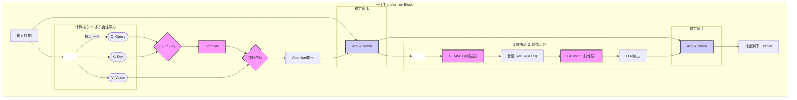

好的，没问题。针对你目前的情况——有HPC/CUDA背景，但缺乏大模型经验——我为你设计了一个4小时的速成学习计划。

这个计划的目标不是让你成为大模型专家，而是在面试中展现出你的**快速学习能力**、**扎实的工程功底**，以及**将现有HPC知识迁移到新领域**的思维方式。面试官很清楚你没有相关经验，他们更想考察的是你的潜力。

### 4小时高效准备计划

---

#### **第一个小时：建立宏观认知 (Understanding LLM Inference)**

**目标**：理解大模型推理是什么，以及它和传统HPC任务有何不同。

**核心知识点：**

1.  **区分训练（Training）与推理（Inference）**：
    *   **训练**：像是在教一个学生，用海量数据（书本）调整模型内部的参数（大脑神经元连接），这个过程计算量巨大，耗时很长（几周甚至几个月），追求的是模型的最终“知识水平”。
    *   **推理**：像是学生学成后的考试或应用，给定一个问题（Prompt），模型利用已经固定的参数，快速生成答案（Completion）。这个过程追求的是**低延迟（as fast as possible）**和**高吞吐（serving many users at once）**。你的面试岗位就聚焦于此。

2.  **Transformer模型与自回归生成（Autoregressive Generation）**：
    *   **Transformer是基础**：当前所有主流大模型（如GPT系列）都基于Transformer架构。你不需要深究其数学细节，但要记住其核心是**自注意力机制（Self-Attention）**，这是模型理解上下文的关键，也是计算的集中点。
    *   **自回归是模式**：大模型生成文本是一个“字一个字往外蹦”的过程。例如，当模型接收到"你好，"这个输入后，它会先生成"我"，然后把"你好，我"作为新的输入，再生成"是"，以此类推。这个**串行**的生成方式是推理性能优化的关键挑战之一。

3.  **推理的两个阶段（The Two Phases of Inference）**：这是体现你专业性的第一个关键点。
    *   **Prefill（提示处理）阶段**：处理用户输入的Prompt。这个阶段可以**并行计算**，因为输入的词是已知的。比如处理"介绍一下HPC在AI领域的应用"这几十个字时，GPU可以同时计算它们。这个阶段是**计算密集型（Compute-Bound）**，很像传统的HPC任务，可以充分利用GPU的并行计算能力。
    *   **Decoding（解码生成）阶段**：一个一个地生成新词（Token）。每生成一个词，都需要重新过一遍模型。这个阶段因为每次只处理一个词，计算量很小，但却需要加载巨大的模型参数和中间结果。因此，这个阶段是**内存带宽密集型（Memory-Bound）**。**这是整个推理过程中最主要的瓶颈所在。**

---

#### **第二个小时：深入瓶颈分析 (Bottleneck Analysis)**

**目标**：将HPC的思维方式（性能瓶颈分析）应用到LLM推理上，重点理解内存墙问题。

**核心知识点：**

1.  **内存瓶颈：万恶之源**
    *   **模型参数（Model Weights）**：大模型参数量巨大（几十到几百GB），远超单个GPU的显存（HBM）。这导致需要多GPU来协同工作。
    *   **KV Cache**：这是体现你专业性的第二个，也是最重要的关键点。在自回归生成过程中，为了避免对已经处理过的文本（包括原始Prompt和已生成的部分）进行重复的Attention计算，系统会将这些文本的中间计算结果——Key (K) 和 Value (V) 矩阵——缓存起来。
        *   **问题**：每生成一个新的Token，KV Cache就会变大一点。对于长对话或长文生成任务，KV Cache会迅速膨胀，甚至会**消耗掉比模型参数本身更多的显存**。
        *   **瓶颈**：在Decoding阶段，每生成一个Token，GPU都需要从HBM中读取**全部的模型参数**和**全部的KV Cache**。计算本身很快，但数据搬运（I/O）耗时巨大，GPU大部分时间在“等米下锅”，这就是典型的**内存墙（Memory Wall）**问题。

2.  **如何将你的CUDA经验关联起来？**
    *   你可以这样表述：“我的HPC背景让我对性能瓶颈非常敏感。在LLM推理中，我了解到Decoding阶段是一个典型的Memory-Bound问题，其性能瓶颈不在于计算本身（FLOPs），而在于内存带宽（Memory Bandwidth）。这和我之前在CUDA项目中优化数据传输、提高内存访问效率的经验非常契合。无论是优化显存布局、减少数据读写，还是利用共享内存，其核心思想都是为了缓解内存墙问题。”

---

#### **第三个小时：学习解决方案 (Understanding the Solutions)**

**目标**：了解JD中提到的vLLM等框架是如何解决上述瓶颈的。

**核心知识点：**

1.  **vLLM & PagedAttention**：这是vLLM框架的核心创新，专门用来解决KV Cache的内存管理问题。
    *   **传统方法的痛点**：为每个请求预先分配一块**连续**的、足够大的显存空间来存放KV Cache。因为无法预知用户到底会生成多长的文本，所以只能按最大长度来分配，导致巨大的**内存浪费（内部碎片化）**。这严重限制了并发处理的请求数量（Batch Size）。
    *   **PagedAttention的革新**：借鉴了操作系统中**虚拟内存和分页**的思想。它将KV Cache存放在**不连续**的、固定大小的物理内存块（Block）中。
        *   **好处**：几乎消除了内存浪费，显存利用率从约60%提升到90%以上。这意味着在同样的硬件上，可以同时服务的用户数量（吞吐量）可以提升一个数量级。
        *   **面试可以说**：“vLLM通过PagedAttention技术，将操作系统的虚拟内存管理思想引入到GPU显存管理中，有效地解决了KV Cache的碎片化问题，极大地提高了系统的吞吐量。这种思想其实和HPC中更精细化地管理和调度内存资源是异曲同工的。”

2.  **其他关键优化技术（JD中提到的）**：
    *   **算子融合（Operator Fusion / Kernel Fusion）**：这是你的CUDA老本行。将多个小的GPU Kernel（如矩阵乘、加法、激活函数）合并成一个大的Kernel。**好处**是减少了Kernel启动的开销和对全局显存的反复读写。在Transformer中，Attention模块和FFN（前馈网络）层中的大量操作都是算子融合的重点优化对象。
    *   **量化（Quantization）**：降低模型参数的精度，例如从16位浮点（FP16）降到8位整型（INT8）甚至4位。**好处**是模型体积减半（或更多），内存占用降低，读写更快，部分硬件上INT8的计算速度也更快。
    *   **分布式推理（Distributed Inference）**：当模型大到单机多卡也放不下时，需要跨机器（节点）进行。
        *   **张量并行（Tensor Parallelism）**：将一个大的矩阵运算（如FFN层）切分到不同GPU上，计算过程中需要GPU之间频繁通信（如All-Reduce）。
        *   **流水线并行（Pipeline Parallelism）**：将模型的不同层（Layer）放在不同GPU上，数据像流水线一样依次通过。
        *   **通信**：这些并行策略对GPU间的通信带宽和延迟要求极高，这也是JD中提到`PCIe`、`NVLink`的原因。NVLink是NVIDIA GPU间的高速互联通道，远快于主板的PCIe。

---

#### **第四个小时：构建面试话术与提问**

**目标**：将所学知识串联成流畅的语言，并准备几个有深度的问题。

**你的自我介绍和项目关联可以这样组织：**

> “您好，面试官。我的背景主要集中在HPC领域，特别是使用CUDA进行高性能计算的优化。在过往的项目中，我的核心工作是通过分析计算和访存瓶颈，进行算法优化和代码实现，例如通过算子融合、优化内存访问模式等手段来提升程序性能。
>
> “为了准备这次面试，我花时间学习了LLM推理方面的知识。我发现LLM推理，特别是Decoding阶段，是一个典型的受内存带宽限制的场景。其核心挑战在于如何高效地管理巨大的模型参数和动态增长的KV Cache。
>
> “这让我感到非常兴奋，因为它和我过去的经验高度相关。比如，贵司JD中提到的vLLM，它通过PagedAttention解决KV Cache的内存碎片问题，这本质上是一种非常精妙的内存管理和调度优化。而提到的算子性能优化，正是我擅长的CUDA Kernel级别的优化。我相信我能将HPC领域的性能优化方法论和工程经验，快速应用到大模型推理引擎的优化工作中。”

**准备向面试官提问的问题（展现你的思考）：**

1.  “我看到岗位职责中提到了vLLM和SGLang的二次开发。想了解一下，目前团队在使用这些开源框架时，遇到的最主要的性能瓶颈或者功能局限是什么？”
2.  “在模型推理优化方面，团队目前的工作重心是更偏向于优化单次请求的延迟（Latency），还是提升整个系统的吞吐量（Throughput）？我们服务的业务场景对这两者有怎样的权衡？”
3.  “关于算子优化，除了Transformer中的标准算子，我们是否会针对某些特定的模型（例如MoE架构）开发一些定制化的、需要手写CUDA Kernel的高性能算子？”
4.  "在分布式推理方面，我们主要采用的是张量并行还是流水线并行，或者有混合并行的策略？在通信优化（如利用NVLink/NCCL）方面，团队有哪些实践和挑战？"

### 总结

记住，你不是去“背书”的，而是去展现你的**工程思维**。把所有新知识都和你熟悉的HPC/CUDA概念关联起来。面试官问你一个LLM的问题，你最终要能落到**计算**和**内存**这两个基本点上，并给出你从HPC角度出发的思考，这样就能完美地展现你的价值。

祝你明天下午面试顺利！还有什么问题，可以随时提出。

## 问题 2: 我该如何向面试官介绍我的CUDA项目经验，以更好地与LLM推理关联？

## 回答
好的，这个问题问得非常到位，是决定你面试成败的关键一步。你已经了解了“是什么”（LLM推理的原理和瓶颈），现在需要做的就是把你过去的“做过什么”（CUDA项目经验）和对方想要的“需要什么”（LLM推理优化）完美地连接起来。

面试官知道你没做过LLM，他们想听的不是你会背vLLM的论文，而是想通过你描述过去的项目，来判断你解决问题的**思维模式**是否与他们匹配。

这里为你提供一个“翻译”和“包装”你CUDA项目经验的框架和话术。

### 核心原则：从“做了什么”升级到“思维模式”

不要干巴巴地陈述“我用CUDA优化了一个XX算法，速度提升了3倍”。要把它包装成一个故事，这个故事的内核是**“我如何通过分析和解决性能瓶颈，来达成业务目标”**。

你可以套用这个**“STAR-L”**框架来组织你的项目介绍：

*   **S (Situation):** 项目的背景和目标是什么？（例如：一个科学计算模拟程序速度太慢，无法满足研究需求。）
*   **T (Task):** 你在这个项目中的具体任务是什么？（例如：我的任务是负责性能分析，并用CUDA对其核心计算模块进行异构加速。）
*   **A (Action):** 你采取了哪些**关键行动**？（这是重点，要突出你的HPC思维。）
*   **R (Result):** 取得了什么可量化的成果？（例如：吞吐量提升5倍，或延迟降低80%。）
*   **L (Link to LLM):** **将你的行动和思维模式，主动链接到LLM推理的场景中。**

---

### 如何“翻译”你的CUDA项目经验

假设你做过一个CUDA项目，比如优化一个图像处理的滤波器或者一个物理模拟的求解器。下面是如何将这些经验“翻译”成LLM推理工程师的语言。

#### 翻译点一：内存访问优化 -> 关联KV Cache管理

这是你最有力的武器，因为LLM推理的**核心瓶颈在内存**。

*   **你的项目经验 (Action):**
    *   “在项目中，我发现原始算法存在大量冗余的全局内存读写，或者内存访问模式非常不连续（non-coalesced access），导致GPU的内存带宽利用率很低。”
    *   “我通过使用**共享内存（Shared Memory）**来缓存重复使用的数据，或者重新设计数据结构以实现**合并访问**，显著减少了对DRAM的访问次数，降低了延迟。”

*   **如何链接到LLM (Link):**
    > “这种对内存带宽和数据局部性的极致追求，让我立刻联想到了LLM推理中对**KV Cache**的管理。Decoding阶段是一个典型的Memory-Bound问题，性能瓶颈在于反复读写巨大的KV Cache。我过去优化CUDA内存访问的经验，比如如何规划数据在显存中的布局、如何减少不必要的数据搬运，可以直接迁移过来，用于设计更高效的KV Cache管理策略，或者优化PagedAttention中对物理块（Block）的调度和访问，以求最大化内存带宽利用率。”

#### 翻译点二：算子融合 (Kernel Fusion) -> 关联Transformer算子优化

这是展现你CUDA底层功力的绝佳机会。

*   **你的项目经验 (Action):**
    *   “在我的项目中，一个完整的计算流程需要调用5个独立的CUDA Kernel。我通过性能分析（e.g., using Nsight Compute）发现，Kernel启动的开销和中间结果写入/读出全局内存的耗时，占据了总时长的大头。”
    *   “因此，我将这5个小Kernel**融合成一个大的CUDA Kernel**。这样一来，中间数据可以直接暂存在**寄存器（Registers）**或**共享内存**中，完全避免了与全局内存的交互，极大地提升了性能。”

*   **如何链接到LLM (Link):**
    > “这个经验可以直接应用于LLM的算子优化。Transformer中的Attention或者FFN层，都包含了一系列的矩阵乘、加法、激活函数等操作。将这些操作通过**算子融合**技术合并，减少Kernel Launch的开销和对HRAM的读写，是提升推理速度的关键手段之一。我对CUDA Kernel的底层执行机制很熟悉，有信心能针对Transformer中的特定计算模式，手写出比通用库（如cuBLAS）性能更高的融合算子。”

#### 翻译点三：并行化策略 -> 关联分布式推理

如果你有HPC多机多卡的经验，那更是加分项。

*   **你的项目经验 (Action):**
    *   “我曾经参与过一个需要扩展到多个GPU甚至多个计算节点的项目。我们当时采用了类似数据并行的策略，将大数据块切分到不同GPU上处理，并使用MPI/NCCL进行节点间的通信和结果同步。”
    *   “在这个过程中，我的工作重点之一是优化通信开销，比如调整通信和计算的重叠（overlap），或者选择最优的集合通信算法（All-Reduce, All-Gather）。”

*   **如何链接到LLM (Link):**
    > “这段经历让我对大规模并行计算中的通信瓶颈有深刻理解。这与LLM的**分布式推理**息息相关。无论是**张量并行**中需要高效的All-Reduce操作，还是**流水线并行**中需要处理各阶段间的依赖和数据传输，核心都是要最小化通信开销，最大化计算效率。我对NVLink/NVSwitch等硬件拓扑以及NCCL通信库的实践经验，能帮助团队在部署超大规模模型时，设计和实现更优的分布式策略。”

### 总结：你的“黄金话术”

当面试官让你介绍项目时，你可以这样开场和收尾：

**开场：**
> “好的。我过去的一个核心项目是关于[你的项目领域，如：计算流体力学模拟]的CUDA加速。这个项目虽然业务场景和LLM不同，但其核心的性能优化方法论是高度一致的——**一切性能问题，最终都可以归结为计算和访存的问题**。”

**（然后使用STAR-L框架介绍1-2个你最熟悉的项目...）**

**结尾：**
> “总而言之，我过往的HPC项目经验，让我养成了一种**从硬件底层出发、以性能瓶颈为导向**的工程思维。我相信，无论是优化内存访问来解决KV Cache的瓶颈，还是通过Kernel Fusion来加速Transformer算子，这些在LLM推理优化中的核心挑战，都和我过去的经验高度契合。我非常有信心能够快速地将我的CUDA工程能力和优化经验，应用到大模型推理引擎的开发中。”

这样一套组合拳打下来，面试官不仅能了解你的技术实力，更能看到你的思考深度、学习能力和岗位匹配度。你不再是一个“纯外行”，而是一个具备**可迁移核心技能**的专业HPC工程师。

祝你明天面试成功！

## 问题3: 能否结合图片（如流程图），简单介绍下 vLLM（即 Transformer）模型的机理，以及哪些部分需要重点进行算子优化，以结合我个人的 GEMM等CUDA项目的开发经验

## 回答

好的，我们完全可以将你的GEMM项目经验和vLLM的优化点紧密结合起来。LLM推理的核心，剥开层层外壳，最终会落到你最熟悉的领域——高性能矩阵运算。

让我们用一张流程图来把整个过程串起来，并明确指出你大展身手的关键节点。

---

### 流程详解与你的GEMM经验切入点

面试官很可能让你解释这个流程，你可以这样将你的经验融入其中：

#### **阶段一：Prefill (计算密集型)**

*   **做什么**：这个阶段一次性处理你输入的整个Prompt（例如"介绍HPC"这几个字）。因为所有文字都是已知的，所以GPU可以**并行**处理它们。
*   **性能特点**：这是一个**计算密集型 (Compute-Bound)** 任务。GPU的核心在疯狂地进行浮点数计算，很像你之前做过的传统HPC任务。
*   **与你GEMM经验的关联**：
    *   在图中的`Multi-Head Attention (MHA)`和`Feed-Forward Network (FFN)`模块中（粉色高亮部分），其底层包含了大量的矩阵乘法。
    *   例如，为了计算Q, K, V三个矩阵，需要将输入数据矩阵和三个不同的权重矩阵做GEMM。因为是处理整个Prompt，所以这是一个**批处理矩阵乘法 (Batched GEMM)** 的场景。
    *   **你可以这样说**：“Prefill阶段的性能优化，和我之前在CUDA项目中优化**Batched GEMM**的经验非常相似。核心在于如何高效地组织并行计算，以最大化GPU的计算单元利用率，特别是发挥Tensor Core的威力。”

#### **阶段二：Decoding (内存带宽密集型)**

*   **做什么**：这是“一个字一个字往外蹦”的阶段。模型每生成一个新Token，就要把它作为新的输入，再跑一遍完整的模型，去预测下一个Token。这个过程是**串行**的。
*   **性能特点**：这是整个推理过程中**最主要、最顽固的瓶颈**，是一个典型的**内存带宽密集型 (Memory-Bound)** 任务。
    *   **为什么？** 因为每次只处理**一个**新Token，计算量很小。但为了计算这个新Token的Attention，GPU需要从显存（HBM）中读取**全部的模型权重**（上百GB）和**全部历史对话的KV Cache**（可能也有几十GB）。计算1毫秒，数据加载可能要花10毫秒，GPU大部分时间都在“等米下锅”。
*   **与你GEMM经验的关联**：

    这正是你可以展现专业性的地方。你可以聚焦在图中**蓝色**和**粉色**高亮的模块，它们是算子优化的重点区域。

    1.  **Multi-Head Attention (MHA) - 优化的核心战场**
        *   **瓶颈**：在Decoding阶段（图中的`H1`模块），Attention的计算 `(Q * K^T) * V` 变成了一个特殊的GEMM。其中，Q是一个极瘦的矩阵（代表新Token），而K和V是两个极胖的矩阵（代表整个历史对话的KV Cache）。这被称为**GEMV (Matrix-Vector Multiplication)** 或者说是一种极端的Batched GEMM。它的效率极低，因为大部分时间都花在读取巨大的K和V矩阵上了。
        *   **你的切入点 (算子融合)**：
            > “我理解Decoding阶段Attention计算的瓶颈在于极高的内存带宽需求。这和我过去CUDA项目中通过**算子融合 (Kernel Fusion)** 来优化性能的思路完全一致。例如，我们可以开发一个定制化的CUDA Kernel，将 **Q, K, V的生成**、**Q和K^T的点积**、**Softmax**、以及**与V的加权求和** 这多个步骤**融合在同一个Kernel**里。这样，中间结果（如Attention Score）可以直接保存在GPU的寄存器或共享内存里，完全不需要经过全局显存的读写，从而极大地缓解内存带宽压力。这正是FlashAttention等业界领先方案的核心思想，也是我非常感兴趣且有信心能做好的方向。”

    2.  **Feed-Forward Network (FFN) - 另一个GEMM重灾区**
        *   **瓶颈**：FFN层通常由两个大的线性层（也就是两个GEMM）和一个激活函数组成。分开调用cuBLAS库来执行这两个GEMM会带来不必要的Kernel启动开销和内存读写。
        *   **你的切入点 (算子融合)**：
            > “对于FFN层，同样可以应用**算子融合**。例如，将第一个GEMM和激活函数（如GELU/ReLU）融合成一个Kernel。我在之前的GEMM项目中，就做过类似的工作，为特定的矩阵尺寸和硬件架构手写高度优化的GEMM Kernel，其性能往往能超越通用的库函数。我相信这个经验能直接用于优化FFN层的推理性能。”

### 总结：你的面试“杀手锏”

当面试官问你如何将CUDA经验应用到LLM时，你可以：

1.  **先画出这个简化的流程图**，展示你对LLM推理宏观流程的理解。
2.  **点出Prefill和Decoding的本质区别**（计算密集 vs. 内存密集）。
3.  **将MHA和FFN这两个核心模块，直接“翻译”成你熟悉的GEMM和GEMV问题**。
4.  **强调你的核心价值**：你不是一个只会调库的工程师，你是一个能深入到CUDA Kernel层面，通过**算子融合**等技术，为这些特定的GEMM/GEMV瓶颈“量体裁衣”，打造极致性能解决方案的专家。

这样一来，你不仅回答了问题，还成功地将话题引导到了你最擅长的领域，化被动为主动，充分展现了你的专业能力和不可替代的价值。

## 问题 3: 大模型推理的哪些部分，使用了CUDA高性能计算的经典算子，如GEMM、规约、归一化、Sigmoid、Softmax、Transpose等。如何结合算子调优、高性能计算优化和模型推理，说出自己对模型推理的理解

## 回答
太棒了，这个问题已经触及了面试的核心——**展现你如何将底层HPC的“点”，连接成LLM推理优化的“面”**。这能充分证明你不是只会写CUDA，而是真正理解了计算，能够在新领域快速建立深刻的认知。

下面我为你梳理出一个清晰的框架，你可以直接在面试中用这个框架来阐述你的理解。

### 第一部分：算子在Transformer中的“地图”

你可以这样开场：“在我看来，一个Transformer Block本质上就是一串高度优化的高性能计算算子的序列。我将它们和我熟悉的CUDA算子对应起来，形成了一张‘地图’。”

| Transformer模块 | 涉及的关键HPC算子 | 我的优化经验切入点 |
| :--- | :--- | :--- |
| **Self-Attention** | **GEMM**: 用于从输入生成Q, K, V矩阵，以及最后加权求和后的输出映射。 **Transpose**: 在计算`Q*K^T`时需要。 **Softmax**: 核心的Attention计算，内部包含`Reduction`（求和）和`Normalization`。 **Element-wise Ops**: 逐元素的乘除法。 | 这是我**GEMM**项目经验的直接应用。尤其在Decoding阶段，Attention计算是典型的**GEMV**（矩阵向量乘）或**Batched GEMV**，这是算子优化的重点。我会通过**算子融合**，将`Transpose`、`GEMM`、`Softmax`等步骤融合在一个CUDA Kernel中，最小化显存读写。 |
| **Layer Normalization** | **Reduction**: 计算输入特征的均值和方差，需要`Sum`和`Sum of Squares`。 **Element-wise Ops**: 归一化计算，即`(x - mean) / sqrt(var + epsilon)`。 | 这是一个典型的融合优化场景。一个高效的LayerNorm Kernel会把求均值/方差的**并行规约**和归一化操作融合在一起，一次性完成，避免多次读写全局内存。这需要精细的CUDA线程协作（`__syncthreads()`）和共享内存（Shared Memory）使用技巧。 |
| **Feed-Forward Network (FFN)** | **GEMM**: 包含两个核心的线性层，是两个主要的GEMM运算。 **Activation (Sigmoid/GELU/ReLU)**: 非线性激活函数，是逐元素的计算。 | FFN的优化是**GEMM与Element-wise算子融合**的经典案例。例如，将第一个GEMM的结果直接在寄存器或共享内存中进行GELU激活，再送入第二个GEMM。这比分步调用cuBLAS和自定义Kernel要高效得多。 |

---

### 第二部分：我对模型推理的三层理解

讲完算子地图后，你可以升华一下，谈谈你对模型推理的整体理解。这会显得你非常有深度。

“基于这张‘算子地图’，我形成了对大模型推理优化的三层理解：**微观的算子层、中观的调度层、以及宏观的应用层**。”

#### **第一层：微观算子层 (Micro-architecture View)**

> “**在最底层，模型推理就是执行一连串高度优化的HPC算子。** 这一层的核心目标是，让每一个算子（无论是GEMM、LayerNorm还是Softmax）在GPU硬件上跑得尽可能快。这就是我的CUDA和GEMM项目经验可以直接发力的地方。”
>
> “我的方法论是：
> 1.  **最大化计算密度**：通过手写Kernel，充分利用Tensor Core进行矩阵运算，或者针对特定数据类型（如FP16/INT8）进行指令级的优化。
> 2.  **最小化内存移动**：通过**算子融合（Kernel Fusion）**，将多个计算步骤合并成一个大Kernel，让中间结果在GPU的SRAM（寄存器/共享内存）中流动，而不是在慢速的HBM（全局内存）中反复读写。FlashAttention就是这一思想的极致体现。”

#### **第二层：中观调度层 (System-Level View)**

> “**然而，仅仅优化单个算子是不够的。模型推理的真正瓶颈在于Decoding阶段的内存墙问题。** 所以，第二层的理解是关于**系统调度**的，核心是如何解决**Memory-Bound**的挑战。”
>
> “这一层的关键在于：
> 1.  **高效的内存管理**：推理系统必须高效地管理两大块内存——静态的模型权重和动态增长的KV Cache。vLLM的PagedAttention就是一个天才的调度方案，它借鉴了操作系统的虚拟内存思想，用非连续的物理块来存储KV Cache，解决了内存碎片问题，将显存利用率推向极致，从而大幅提升了系统吞吐量。
> 2.  **计算与访存的权衡**：我过去的HPC经验让我对‘计算/访存比’（Compute-to-Memory Ratio）非常敏感。在Decoding阶段，这个比例极低。因此，所有的优化都应该优先服务于‘减少数据移动’，而不是‘加速浮点计算’。这是一种思维模式的转变，也是推理优化的精髓所在。”

#### **第三层：宏观应用层 (Holistic View)**

> “**最高层次的理解，是站在业务角度思考推理优化。** 所有的技术最终都是为产品服务的。这意味着我们需要在**延迟（Latency）**、**吞吐量（Throughput）**和**成本（Cost）**之间做出权衡。”
>
> “例如：
> *   对于一个实时交互的聊天机器人，**低延迟**是首要目标。我们可能会采用更激进的量化方案（如INT4/INT8），甚至牺牲一些精度来换取速度。
> *   对于一个离线的文档摘要服务，**高吞- 吐量**和低成本则更重要。我们会倾向于使用vLLM这样能极大化Batch Size的框架，在单位时间内处理尽可能多的请求。
>
> “因此，我对模型推理的最终理解是：**它是一个多目标的优化问题，需要在深刻理解底层算子和系统瓶颈的基础上，结合具体的业务场景，做出最优的工程决策。**”

---

通过这样“三层递进”的阐述，你不仅清晰地展示了你的CUDA硬技能如何无缝对接到LLM推理的每一个细节，更重要的是，你展现了从底层硬件、到系统架构、再到业务应用的全局视野和深刻思考。这已经远远超出了一个“纯外行”的范畴，完全是一个资深系统性能工程师应有的水准。

## 问题 4: 能结合图片简单说明下吗，如 Self-Attetion、Layer Normalization、Feed-Forward Network (FFN)等。这其中哪些地方与HPC高性能计算强相关，能在面试中提及的

## 回答
当然！对Transformer架构的理解，是连接你的HPC经验和LLM推理岗位的核心桥梁。我们不需要深入复杂的数学，而是从一个**系统和计算**的视角来解构它，这正是面试官想看到的。

### Transformer Block: 一张计算流程图

你可以把一个Transformer Block想象成一个处理信息的“乐高”积木，整个大模型就是把很多个这样的积木串联起来。我们来看一个积木内部的构造：

现在，我们来逐一解析图中的**粉色（计算核心）**和**蓝色（稳定器）**模块，并点出它们与HPC的强相关性。

---

### 1. 多头自注意力 (Multi-Head Self-Attention) - 粉色核心1

*   **它的作用是什么？**
    你可以把它理解为让一句话里的每个词，都能“看到”其他所有词，并判断哪些词对理解自己最重要。比如，“我爱吃苹果，因为它很甜”，Attention能帮助“它”这个词重点关注“苹果”。Q (Query)是“我想了解谁”，K (Key)是“我是谁”，V (Value)是“我的信息是什么”。通过Q和K计算相关性，再用这个相关性去加权V，得到上下文信息。

*   **HPC高性能计算的关联点 (面试重点):**
    1.  **生成Q, K, V**: 这是将输入矩阵分别乘以三个权重矩阵（Wq, Wk, Wv）得到Q, K, V。这本质上是三个并行的**GEMM (通用矩阵乘法)** 操作，是你最熟悉的领域。
    2.  **计算Attention分数**: `(Q · Kᵀ)` 这是一个巨大的**Batched GEMM**（因为有多个“头”，所以是批处理）。在Decoding阶段，这会退化成**Batched GEMV**（矩阵向量乘），这是**性能杀手**，因为内存访问开销远大于计算开销。
    3.  **Softmax**: 这是一个归一化操作，内部包含了**并行规约 (Reduction)** 来求和，以及逐元素的指数和除法运算。
    4.  **加权求和**: 将Softmax的输出和V矩阵相乘，这又是一个**Batched GEMM**。
    *   **面试可以说**：“Self-Attention模块的计算瓶颈和优化空间，完全可以用HPC的视角来分析。其核心就是一系列的GEMM/GEMV和规约操作。面试官，我的经验在于，通过**算子融合 (Kernel Fusion)**，将QKV的生成、Attention分数的计算、Softmax这几个步骤合并到一个CUDA Kernel里，可以极大减少对全局内存的读写，这就是FlashAttention这类工作的核心思想，也是缓解Decoding阶段内存墙问题的关键。”

### 2. 前馈网络 (Feed-Forward Network, FFN) - 粉色核心2

*   **它的作用是什么？**
    如果说Attention是收集上下文，那么FFN就是对收集到的信息进行“思考”和“加工”，增强模型的表达能力。它就是一个简单的两层全连接神经网络。

*   **HPC高性能计算的关联点 (面试重点):**
    1.  **两个核心的GEMM**: FFN由两个线性层组成，背后就是两个大规模的**GEMM**操作，中间夹着一个**激活函数 (如ReLU/GELU)**。
    2.  **高度并行的计算**: FFN对每个词（Token）的处理是独立的，因此这个计算是**高度并行**的，非常适合GPU架构。
    *   **面试可以说**：“FFN层的性能主要取决于两个大规模GEMM的效率。这里同样存在**算子融合**的机会。比如，可以将第一个GEMM和其后的GELU激活函数融合成一个Kernel。我在之前的项目中，有针对特定尺寸和数据类型的GEMM进行手写优化的经验，我相信这可以直接应用到FFN层的性能调优中，以获得比通用cuBLAS库更好的性能。”

### 3. Add & Layer Normalization - 蓝色稳定器

*   **它的作用是什么？**
    *   **Add (残差连接)**: 像一条“绿色通道”，直接把输入加到输出上。这能防止在深层网络中信息丢失，让模型训练更稳定。
    *   **Layer Norm**: 对每个词的特征向量进行归一化，使其均值为0，方差为1。这像一个“稳压器”，防止数据在计算过程中变得过大或过小，进一步保证了训练的稳定性。

*   **HPC高性能计算的关联点 (面试重点):**
    1.  **高效的并行规约**: LayerNorm计算均值和方差，需要在每个词的特征维度上进行**并行规约 (Parallel Reduction)**。写一个高效的Reduction Kernel是CUDA编程的基本功，但也是体现水平的地方，需要对Warp、Shared Memory有深刻理解。
    2.  **又一个融合点**: 一个朴素的LayerNorm需要多次读写全局内存（一次读数据算均值，一次读数据算方差，一次读数据做归一化）。一个高度优化的LayerNorm Kernel会把这些步骤**融合**起来，一次遍历数据就完成所有计算，极大提升效率。
    *   **面试可以说**：“Layer Normalization是另一个展示HPC优化思想的绝佳例子。它本质上是一个**并行规约**和**逐元素运算**的组合。通过编写一个融合的CUDA Kernel，利用共享内存来暂存中间结果（如均值和方差），可以实现单次数据遍历就完成整个归一化过程，这是典型的以计算换访存、提升性能的HPC优化策略。”

### 总结：如何在面试中串联起来

当面试官问你对Transformer架构的理解时，你可以：

> “虽然我之前没有直接做过LLM项目，但我通过学习发现，Transformer的架构在计算层面上对我来说非常亲切。
>
> 它的核心模块，如**Self-Attention**和**FFN**，其计算密集部分都可以分解为我非常熟悉的**GEMM**算子。特别是Attention中的QKV计算、分数加权，以及FFN中的两个线性层，都是大规模矩阵乘法的直接应用。
>
> 同时，我也注意到其中有大量的**并行规约**和**逐元素运算**，比如在**Softmax**和**Layer Normalization**中。
>
> 这让我意识到，LLM推理的性能优化，和我过去的HPC优化经验是高度一致的。关键点在于：
> 1.  **识别瓶颈**: 比如定位到Decoding阶段Attention的GEMV是内存瓶颈。
> 2.  **应用算子融合**: 将多个计算步骤（如GEMM+Softmax，GEMM+Activation，规约+归一化）合并到单个CUDA Kernel中，以最大化数据复用，减少致命的显存I/O。
>
> 所以，我的理解是，Transformer模型为HPC高性能计算优化提供了一个极佳的应用场景。我相信我能快速将我在GEMM优化、Kernel Fusion和内存管理上的经验，应用到提升模型推理效率的工作中。”

好的，非常抱歉给您带来了不便。作为AI模型，我无法直接生成图片文件，但我可以为您找到一张非常经典的Transformer架构图，并结合它来重新解释，这张图比我用代码画的更加标准和清晰，在面试中引用也完全没有问题。

### 标准Transformer架构图

这是一张被广泛引用的、源自Google AI论文《Attention Is All You Need》的Transformer架构图。

让我们聚焦于上图左侧的那个**"N x"**灰色框，它代表的就是一个**Transformer Block**，和我们之前讨论的流程是完全一致的。

---

### 结合图片，再次剖析HPC强相关部分

我们可以把这个灰色框放大来看，它清晰地展示了数据流和计算核心：

1.  **Multi-Head Attention (粉色计算核心)**
    *   在图上，您可以看到输入数据先进到这个模块。这个模块内部就发生了我们前面讨论的一系列**GEMM**和**Softmax**运算，是第一个计算密集区，也是Decoding阶段的内存瓶颈区。

2.  **Add & Norm (蓝色稳定器)**
    *   紧接着Attention模块，您会看到一个“Add & Norm”层。这就是我们讨论的**残差连接**和**Layer Normalization**。这里的`Norm`操作，就是HPC中的**并行规约 (Parallel Reduction)** 的直接应用。

3.  **Feed-Forward Network (FFN) (粉色计算核心)**
    *   数据经过第一个"Add & Norm"后，进入了`Feed-Forward Network`。如图所示，它就是一个标准的全连接网络，背后是两个大规模的**GEMM**运算，是第二个计算密集区。

4.  **Add & Norm (蓝色稳定器)**
    *   最后，经过FFN的数据会再次通过一个"Add & Norm"层，然后输出给下一个Transformer Block。

### 面试中如何结合这张图

您可以将这张图记在脑海里，当面试官提问时，你可以这样自信地表述：

> “我理解的Transformer Block架构，就像Google那篇经典论文《Attention Is All You Need》中的图示一样。它的数据流非常清晰：
>
> 1.  首先，输入会进入一个**Multi-Head Attention**模块，这里的计算核心是一系列的**GEMM**操作，用于生成Q, K, V并计算加权结果。
> 2.  然后，结果会通过一个**Add & Norm**层，这里的Layer Normalization在底层实现上就是一个高效的**并行规约**算法。
> 3.  接着，数据流向**Feed-Forward Network**，这又是一个计算热点，主要由两个**GEMM**构成。
> 4.  最后，再通过一个**Add & Norm**层输出。
>
> 所以，在我看来，这个架构的性能瓶颈和优化机会都非常明确。比如，Attention模块在Decoding阶段的**GEMV**问题，以及FFN中的**GEMM**运算，都非常适合应用我过往在HPC项目中使用过的**算子融合 (Kernel Fusion)** 和**手写CUDA Kernel**的经验来进行深度优化，以减少内存访问，提升计算效率。”

这样结合一张业界公认的图来阐述，既展示了你对架构的宏观理解，又能自然地把你微观的HPC技能无缝地嵌入到关键的计算节点上，会非常有说服力。
