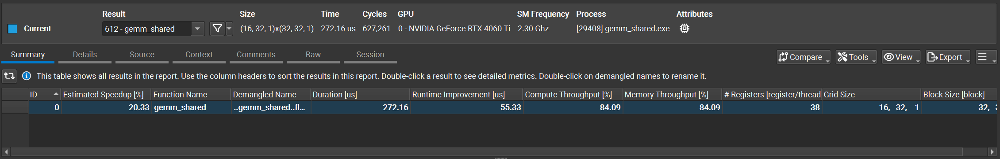
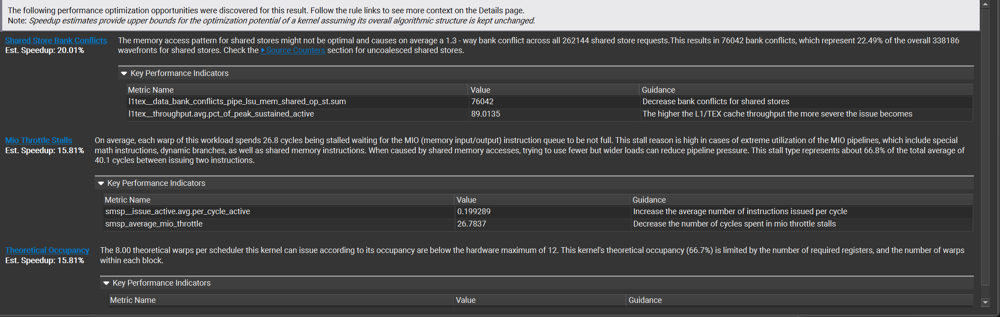
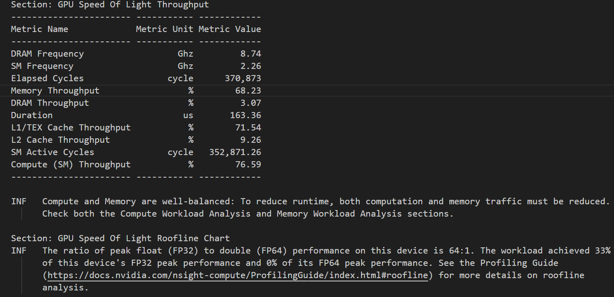

# GPU性能诊断 (CUDA)

基于 Nsight Compute的GPU性能诊断。

**官方文档：**

1. [Nsight Compute Documentation](https://docs.nvidia.com/nsight-compute)
2. [Performance Guidelins](https://docs.nvidia.com/cuda/cuda-c-programming-guide/)


## 0 核心理论知识

1. GPU硬件架构：SM的基本组成
   1. CUDA Core
   2. 寄存器File
   3. L1缓存
   4. 共享内存
   5. Tensor Core
2. CUDA基础编程模型
3. 内存模型：各级内存的特性、访问延迟、带宽
   1. 全局内存
   2. 共享内存
   3. 纹理内存 & 常量内存
   4. L2缓存
4. Warp执行机制：
   1. Warp调度
   2. Warp Divergence问题：概念、原因、解决
5. 内存访问模式： Memory Coalescing(内存合并)

## 学习目标

**重点关注以下几个方面：**

1. **Nsight Compute UI 基本操作：** 学习如何启动 Nsight Compute，连接到目标程序，并进行基本的性能剖析（profiling run）。
2. **核心指标理解：** 了解 GPU 架构的基本概念（如 SM、Warp、Thread Block、Latency、Throughput）以及 Nsight Compute 中与之相关的**重要指标** 。
3. **基线（Baseline）性能分析：** 能够运行程序并获取初始性能数据，找出最耗时的 CUDA Kernel。
4. **识别主要瓶颈类型：** 掌握如何判断性能瓶颈是计算限制（Compute-Bound）、内存限制（Memory-Bound）、还是访存延迟限制（Latency-Bound）。

## 1 性能优化策略

性能优化的基本策略如下：

1. 并行计算最大化 -> 实现利用率(utilization)最大化
2. 内存使用最优 -> 实现内存吞吐量(memory throughput)最大化
3. 指令使用最优 -> 实现指令吞吐量(instruction throughput)最大化
4. 内存抖动(thrashing)最小化

### 1.1 利用率最大化 (Maximum Utilization)

#### 1.1.1 主机应用层

**性能瓶颈：** 主机、设备与总线之间的并行性能瓶颈。

**原则：** 将串行Workload分配给主机，并行Workload分配给设备。

**方法：** 通过异步函数调用async、流cudaStream(如事件同步、异步传输等)，平衡主机、设备和总线的工作负载。

**设备工作负载瓶颈：**

1. 同一块内的线程，在使用同一个内核的共享内存时，通过__syncthreads()完成内存同步，影响线程并行(需等待其他线程完成后继续操作，造成延迟)
2. 执行的线程分属不同线程块，无法直接实现数据共享

#### 1.1.2 设备层

**性能瓶颈：** 多个SM之间的并行执行性能。

**方法：** 使用流(cudaStream)让足够多的内核(kernels)并发执行。

#### 1.1.3 硬件层 (SM、Warp调度)

**性能瓶颈：** Warp在处理指令时的延迟(Warp Latency)。

**延迟类型：**

1. 内存操作延迟 (Memory Latency)
   1. 全局内存(Global Memory)：最主要的延迟来源。Warp发出读取指令时，数据经由 全局内存 -> L2缓存 -> SM的L1缓存 -> 寄存器，整个过程可达数百个时钟周期。
   2. 共享内存(Shared Memory)：可能的延迟来源。相比全局内存，数据可直接由块内传输。延迟来源主要为 Bank Conflict(同Warp不同线程的串行化内存操作)。
2. 指令延迟 (Instruction Latency)：较复杂的数学运算或原子操作(如atomicAdd)产生较多的时钟周期。

#### 1.1.4 延迟隐藏技术 (Latency Hiding)

**基本原理：** 通过Warp调度器，在某一Warp因等待高延迟操作结果而阻塞时，立即切换到其他就绪的Warp继续执行指令，不让计算单元(SM)闲置。

**硬件基础：** SM包含大量可执行资源(Cuda Cores、共享内存、寄存器File)，支持大量线程管理(Ampere架构可管理2048个线程)。

1. 调度器就绪队列：SM上的Warp调度器，包含若干Warps队列，其记录着所有加载到此SM的Warp状态
2. Warp切换机制：当一个Warp发出全局内存读取请求 / 执行多时钟周期的操作时，变为堵塞状态；此时调度器切换到另一个就绪的Warp，SM执行此Warp的指令
3. **零开销切换**：多重上下文机制。所有Warp的状态(程序计数器、寄存器)都已记录在SM，只需由Warp调度器改变指针，将计算单元指向下一个Warp的上下文即可让其执行指令；无需保存和恢复寄存器，造成时延。

#### 延迟隐藏的应用

##### (1) 最大化常驻Warp数量 (提升SM占用率)

**原则：**在Warp阻塞时，让SM有足够的Warp。常驻Warp的数量，受限于SM内**寄存器**和**共享内存**数量的使用。

1. **优化寄存器使用：** 控制每个线程使用的寄存器大小。由于SM的寄存器大小固定，且为全部线程共用。单个线程占用过多，会导致分配的Warp数量减少，降低延迟隐藏能力。
2. **优化共享内存使用：** 控制每个线程块使用的共享内存大小。原因同上。

Warp数量的计算：

```cpp
// 获取GPU参数
cudaGetDevice(&device);
cudaGetDeviceProperties(&prop, device);

// 常驻(活跃)Warps数
activeWarps = numBlocks * blockSize / prop.warpSize;

// SM最大Warps数
maxWarps = prop.maxThreadsPerMultiProcessor / prop.warpSize;
```

##### (2) 增加指令级并行性

**原则：** 指令穿插。在一个Warp执行某项高延迟操作后，穿插其他不依赖于操作结果的指令(如加载结果)，避免等待导致时延，而是连续执行。这种方法也称作“提升指令独立性”。
代码示例：

```cpp
// 访问全局内存，高延迟操作
float A = global_mem[idx];  
// 插入其他操作，隐藏延迟，同事等待上一操作完成
do_some_computation();
// 依赖操作，需等待 A 完成
float C = B * A;
```

##### (3) 优化内存访问模式 (最佳方式)

1. **内存合并访问 (Memory Cpalescing)**
   **原则：** 同一Warp内对全局内存的访问操作(读取&写入)是连续且对齐的。这样即可将32次访问事务合并为少数几次事务，提升效率。
2. **使用共享内存 (Shared Memory)**
   **原则：** 利用共享内存高带宽、低延迟的特点。对于重复访问的数据，可将数据分解后加载到共享内存中(此过程为高延迟)，再在共享内存处理并从其中访问(低延迟)。可有效降低延迟。注意访问共享内存时需要使用 __syncthreads()确保Block内线程可见性。

##### (4) 显示同步的使用 (__syncthreads && __syncwarp)

**原则：** 正确使用同步，可避免共享内存的数据访问异常；也可允许编译器和硬件正确调度，适当降低时延。

### 1.2 内存吞吐量最大化 (Maximum Memory Throughput)

**原则：**

1. 尽量减少主机与设备，即CPU与GPU之间的数据传输。CPU与GPU采用PCIE总线连接，传输速率远小于GPU内部(GDDR或HBM)。
2. 最大化片上内存(SM)使用，减少全局内存访问事务。即使用共享内存和L1缓存，和全设备可用的常量内存、纹理内存。
   通常会增加共享内存的使用，进行数据加载并同步块内线程。

### 1.3 内存抖动最小化 (Minimize Memory Thrashing)

**原则：**

1. 合理分配内存规模。尽量避免占用全部可用内存，内存分配指令如 cudaMalloc, cudaMallocHost，会加OS调度器压力，或强制中断其他GPU程序。
2. 需要时分配。不需要时，避免使用分配(cudaMalloc)和销毁(cudaFree)命令。
3. 灵活使用内存类型。当可用内存不够时，考虑使用固定内存(cudaMallocHost)或统一内存(cudaMallocManaged)。
4. 适当使用统一内存。统一内存(cudaMallocManaged)不会立刻占用内存空间，可减轻OS调度器压力；且较高级的架构支持oversubstitution功能。

## 2 基础指标

最核心的指标包含：占用率、吞吐量、延迟、缓存命中率和执行效率

### 2.1 占用率

**原理：** 活跃Warps数量占SM理论最大Warps数的百分比。占用率过低则可能存在较高的延迟。衡量**硬件资源限制或调度性能**。

**场景：** 高占用率，有利于kernel频繁访问全局内存或执行长延时指令时，隐藏延迟。

**问题：** 占用率低，表明存在资源限制。线程块内占用资源(共享内存和寄存器)过多，导致一个SM无法分配足够的Block。

**优化：**

1. 最优化BlockSize
2. 减少寄存器使用量：可用局部变量代替，并简化复杂表达式
3. 减少共享内存使用量：优化内存访问模式

### 2.2 计算吞吐量

**原理：** 代表SM实际计算速度，与理论计算速度比较。衡量是否存在**计算瓶颈**。通常为浮点运算，单位为TFLOP/S

**场景：** 执行复杂数学运算的kernel

**问题：** 计算吞吐量远低于峰值，表明存在严重的延迟。

1. 可能存在Warp Divergence
2. 计算饱和度低：kernel中存在大量内存访问而非计算的步骤

**优化：**

1. 消除Warp Divergence：确保同一Warp内不同线程执行相同的指令
2. 采用更高效的指令：如指令融合。举例：使用FMA操作，将乘法和加法融合为一条指令计算，增加计算吞吐量
3. 使用编译器优化：通过编译器优化寄存器分配和指令调度(增加指令级并行性)，实现延迟隐藏。

### 2.3 内存吞吐量

**原理：** 单位时间内，Kernel从全局内存(或L2/DRAM)实际读写的字节数。衡量Kernel是否存在**带宽限制**。如果实际内存吞吐量远低于理论最大内存带宽，则存在**内存瓶颈**。

**场景：** 计算强度小但数据传输量大的Kernel。如向量加法、数据拷贝等。

**问题**：

1. 主机与设备间的内存传输瓶颈
2. GPU内存传输瓶颈
   1. 大量使用全局内存传输：带宽低、传输速率慢
   2. 内存非合并访问(Non-Coalesced)

**优化：**

1. 优化主机-设备间传输：
   1. 减少主机-设备间的数据传输事务：(1)在设备内存中创建合适的数据结构，由设备代码操作并销毁，减少和主机的数据传输，但需要满足大小和对齐要求；(2)合并多次跨域传输事务为单次大批量传输，性能更优。
   2. 使用页锁定内存(也称固定内存)：直接使用主机的固定内存，可隐式地实现主机-设备间的数据传输
   3. 使用统一内存(Unified Memory)：使用单一指针，由CUDA显式且自动在CPU-GPU间传输。
2. 优化GPU内存传输
   1. 内存合并访问：确保相邻线程读取和写入连续的内存
   2. 使用共享内存代替全局内存
   3. **全局内存**的数据，需使用**对齐的数据结构**：防止访问事务被编译为多条交错访问模式的指令(无法实现指令合并)

```cpp
struct __align__(8)
{
    float x;    // float1, 占1个字节
    float y;    // float1, 占1个字节
}
```

或

```cpp
struct __align__(16)
{
    float x;    // float1, 占1个字节
    float y;    // float1, 占1个字节
    float z;    // float2, 占8个字节
}
```

### 2.4 延迟

**原理：** 指令发出后，平均等待执行的周期数。延迟高，则可能存在内存等待实际长、活跃Warps数过低或Warp调度不合理、依赖关系复杂等问题。

**问题及优化**： 参考1.1.4 延迟隐藏相关。

### 2.5 L1/L2 缓存命中率

**缓存命中的含义：** 由于缓存相比全局内存，带宽高、更靠近SM。缓存命中率高，表明数据可以在高速缓存中找到，无需访问较慢的全局内存。

**原理：** 数据在各级缓存命中的频率。也是衡量**数据局部性和复用性**的关键指标。数据经常被复用，则其在缓存中不会被消除。

**问题：** 命中率低，则存在局部性和复用性的问题。

1. 空间局部性差：线程访问的内存地址较分散，无法填满缓存行。
2. 复用性：数据长时间未被复用，在缓存中被消除或替换，无法命中。

**优化：**

1. 合并内存访问：确保相邻线程访问的内存地址也是连续的。
2. 使用共享内存：提高数据复用性
3. 调整L1缓存配置

### 2.6 执行效率 (Achieved Occupancy)

## 3 性能分析

接下来，我们结合 Nsight Compute 工具的分析报告，和 ncu 指令，完成一次完整的性能分析。

### 3.1 总结 Summary

以编者的矩阵乘法 block_tile方法为例，Kernel 命名为 gemm_shared，其 Nsight Compute 性能分析报告如下。

1. 程序概况
   Summary 显示了程序总体的概况及运行结果。

   - Size: 程序调用的 GrideSize 和 BlockSize, 即Grid 内占用的线程块数、每个块内的线程数
   - Time: 程序总耗时
   - Cyclys: 执行周期
   - GPU: 设备 GPU 型号，编者使用 RTX 4060 Ti
   - SM Frequency: GPU 的 SM 片的执行频率
   - Attributes: 硬件特性，如 SM 片数量
2. Kernel 概况
   中间的表格，展示了程序调用的每个 Kernel 的概况

   - Estimated Speedup [%]: 预估的运行速度提升空间，由 Nsight Compute 提供的多个优化建议中提升幅度最大值决定
   - Function Name: Kernel 的名称
   - Demangled Name: 去掉修饰符的 Kernel 名称，如 `void gemm_shared<1024, 256, 512, 32>(float *, float *, float..`
   - Duration [us]: Kernel 的运行时间，这里为 272.16 us
   - Runtime Improvement [us]: 运行时间可以减少多少，即 Estimated SpeedUp(%) * Runtime Improvement(us)
   - Compute Throughput [%]: 计算吞吐量，代表 SM 片内计算单元的使用率，衡量计算强度大小。
   - Memory Throughput[%]: 内存吞吐量，代表 GPU 内存带宽的使用率，亨利内存负载大小。
   - #Registers: SM 片内每个线程使用的寄存器资源量



3. 优化建议
   Nsight Compute 会结合 Kernel 执行情况、硬件资源等因素，给出若干条改进建议。可大致分为以下两类：

   - 网格与启动配置类 (Grid)
   - 占用率与资源限制类 (Occupancy and Limits)
   - 内存访问效率类 (Memory Access)
   - 计算流水线与指令类 (Pipeline and Instruction):

下图为 gemm_shared.cu 性能分析的三条建议。可以明显的看到：

- 问题点：存在的问题，由蓝色字体显示，如 Shared Store Bank Conflicts
- Est. Speedup 理论速度提升百分比
- 问题详情：在问题点名称右侧，详细介绍了存在的问题和产生机理。
- Key Performance Indicators: 关键性能指标。涉及此条问题点的关键指标，包括 Metric Name (指标名称)、Value (指标值)、Guidance (优化建议)。



### 3.2 性能分析 Profiling Sections

我们结合 Ncu 命令与 Nsight Compute 工具生成的分析报告，其性能分析栏大致相同。

性能分析时，重点关注以下Sections:

1. GPU Speed Of Light Throughput (GPU 吞吐量)
2. Compute Workload Analysis (SM 计算负载分析)
3. Memory Workload Analysis (GPU 内存负载分析)
4. Warp State Statistics (Warp状态统计)
5. Occupancy (SM 内部资源占用率)
6. Schedular Statistics (Warp 调度器统计)
7. Launch Statistics (内核启动统计)

#### 3.2.1 宏观诊断 - GPU Speed Of Light Throughput

最宏观的指标，也是应该第一个检查的内容。

通过各项指标和 Roofline Model, 确定问题的大致方向，是计算/内存瓶颈。



**关键指标：**

1. Memory Throughput: 内存吞吐量。如果与计算吞吐量差异较大 (＞30%)，且内存吞吐量较高 (＞80%)，代表一直在进行内存传输，计算前后 SM 在等待内存数据传输完毕，浪费了大量的时间。
2. Compute Throughput: 计算吞吐量。如果与内存吞吐量差异较大，且计算吞吐量较高，代表 GPU 计算强度高。

#### 3.2.2 根因定位 - Occupancy & Launch Statics


#### 3.2.3 深度剖析 - Memory & Compute Workload Analysis


### 3.3 性能分析模型 (Profiling Models)

1. Roofline Charts (屋顶模型)
2. Memory Chart (内存图表)
3. Memory Tables

#### 3.2.1 Roofline Charts

**原理：** 通过图线，区分内存瓶颈或计算瓶颈。

**组成**：

- X轴：Arithmetic Intensity, 代表**算术强度**，即工作量(每秒浮点运算次数)与内存传输量(每秒字节数)的比值；单位FLOP/byte
- Y轴：Performance, **每秒浮点运算次数(FLOP/s)**
- 交点：Ridge Point, 是**内存带宽边界**和**峰值性能边界**的交汇点。
- 交点左侧斜线：内存带宽边界；默认由GPU的内存传输速率决定，也可自定义
- 交点右侧水平线：峰值性能边界；默认由GPU的峰值性能决定，也可自定义
- 同心圆点：Achieved Value，代办**当前kernel的实际性能**。

## 4 问题定位

### 4.1 网格与启动配置类 (Grid)

**原理**: 整个 CPU 的“宏观并发”，即优化网格尺寸，调整 GridSize 和 BlockSize, 使尽可能多的 SM 片参与计算。

#### 4.1.1 Tail Effect (尾部效应)

**产生机理：** 受硬件限制， Grid 中的 Blocks 总数无法被 GPU 并发能力（SM 片数 x 每个 SM 最大驻留的 Blocks 数）整除，导致最后一个 Wave 只有部分 SM 在工作，其他 SM 空闲等待。

**优化：** 调整 GridSize
- 增大处理数据量
- 调整 Grid 维度，尽量使其等于 (SM 数 x N) 的整数倍
- 适当减小 BlockSize, 以增加 Blocks 总数

#### 4.1.2 Grid Size Too Small (网格尺寸过小)

**产生机理：** 启动的 Blocks 数量太少，导致部分 SM 片没有驻留 Block、全程空闲。

**优化：** 增大 GridSize
- 启动更多的 Block，减少每个 Block 处理的数据量，让每个 SM 都能驻留更多的 Blocks
- 增加批处理大小 Batch Size

#### 4.1.3 Inefficient Block Size （低效的线程块尺寸）

**产生机理：** BlockSize 设置不合理，导致运行低效。
如：
- BlockSize 不是 32 的整数倍，导致部分 Warp 填充不满
- BlockSize 过小，导致从 SM 未满载运行

**优化：** 调整 BlockSize 到合适的值。
- 一般设置 `BlockSize = 128, 256, 512` 的倍数
- 确保 BlockSize 是 32 的整数倍，保证每个 Warp 填满

### 4.2 占用率与资源限制类 (Occupancy and Limits)

**原理**：SM 片内的“微观并发”，最大化片内同时运行的 Warps 数量，提高占用率，并相应提升**延迟隐藏** (Latency Hiding) 能力。

#### (1) Low Theoretical Occupancy - Register Limited

**机理：** 寄存器限制导致的 SM 理论占用率偏低。
- Warp 内每个线程占用的寄存器资源过多，导致 SM 可驻留的 Blocks/Warps 过少。
- `Achieved Blocks (实际驻留块数) <= Block Limit Registers (寄存器限制的块数) ≈ Register File (SM 内寄存器大小) / Registers Per Thread (每个线程占用的寄存器资源)`

**优化：** 减少寄存器压力
- 使用 `__launch_bounds__` 强制限制核函数使用的寄存器数量。超过线程限制时，核函数不会启动。

```cpp
// 使用 __launch_bounds__ 修饰
// maxThreadsPerBlock 为必选项，设置块内最大线程数
__global__ void __launch_bounds__(int maxThreadsPerBlock, int minBlocksPerMultiprocessor, int maxBlocksPerCluster)
MyKernel(...)
{
    ...
}
```
- 减少核函数内局部变量的使用，每个线程占用更少的寄存器
- 将部分寄存器内的数据，溢出到 Shared Memory

#### (2) Low Theoretical Occupancy - Shared Memory Limited

**机理：** 共享内存限制导致的理论占用率偏低。
- 每个线程块内申请的共享内存空间过大，总申请空间超过了 SM 内可用的共享内存。

**优化：** 优化共享内存空间使用。
- 减小 Shared Memory 数组大小
- 改用 __half (FP16) 或 int8 存储数据，节省空间
- 调整 BlockSize, 平衡 Shared Memory 空间大小与 Occupancy。适当增大 BlockSize, 增加块内 Warps 数

#### (3) Block / Warp Limit

**机理：** 受 GPU 硬件限制的最大 blocks 和 warps 数量。

**优化：** 调整 Block 配置
- 如果受 Block 限制，可适当增加 BlockSize, 在不增加片内 Blocks 数的情况下，增加线程数

### 4.3 内存访问效率类 (Memory Access)

**原理**：内存带宽。

#### (1) Uncoalesced Global Access

**机理：** 全局内存未合并。Warp 内的 32 个线程访问的全局内存地址不是连续的，导致单次的内存访问事务被拆分成多次，造成带宽浪费。

**优化：** 如下，同 “低缓存命中率”。

#### (2) Shared Store Bank Confilict

**机理：** 共享内存的 Bank 冲突。Warp 内的多个线程，同时访问了同一个 bank (不同地址)，导致访问串行化。

**优化：** 消除 Bank 冲突
- 填充 Padding: 在共享内存列方向多加一列，如 `__shared__ smem[32][33];`
- 改变索引映射逻辑 Swizzling

#### (3) Low L1/L2 Cache Hit

**机理：** L1/L2 缓存命中率低。表面数据复用性差，经常穿过缓存去访问全局内存，传输效率低。

##### 异常情况： 较差的数据复用

**特征：** 低 L1 缓存吞吐量，极高的 L2 缓存吞吐量和极高的 DRAM 吞吐量。

**产生机理：** 全局内存数据**未合并访问**。这样导致线程无法在 L1 甚至 L2 缓存中抓取数据，必须层层向下请求，最终在显存 DRAM 上执行数据访问请求。

##### 缓存命中率与吞吐量的关系

缓存命中率 (也即请求量) 与 L1 命中率成近似反比。
`L2 请求量 ≈ L1 请求量 x (1 - L1 命中率)`
- L1 Hit Rate (命中率) 低  -> L2 吞吐量增大
- L2 Hit Rate (命中率) 低 -> DRAM 吞吐量增大

两种缓存命中率都很低，导致DRAM吞吐量居高不下，这种现象称为 **Cache Thrashing (缓存抖动)**。

##### 数据复用差 (即缓存命中率差) 的原因

###### A. 【最常见】空间局部性差 (Low Spatial Locality)

- **未合并访问 (Uncoalesced Access)**
	- **机理：** 同一个 Warp 内连续的线程，访问非连续的内存地址。如线程 0 读取 地址 0, 线程 1 读取 地址 100...
    - **后果：** L1 缓存行通常是 128 字节，此时只读取了一个 4 字节数，其余 124 字节被浪费。有效利用率极低。
    
- **跨步访问 (Strided Access)**
	- 案例：矩阵数据按行优先存储，但按列读取。造成相邻线程跨步访问。

###### B. 时间局部性差 (Low Temporal Locality)

- **工作集过大**
	- 机理：数据总量过大，导致循环中需要反复读取的数据量，超过了 L1 或 L2 缓存总量
    - 后果：当上一个数据 A 需要复用时，其他数据 B 已经在缓存中占用了，即数据挤出。
    
- **流式处理**
	- 案例：向量加法 `C[i] = A[i] + B[i]`, 计算过程简单，数据只读、写一次，不存在数据复用场景。此时缓存 Hit Rate 低是正常的。

###### C. 随机访问 (Random Access)

- 间接索引：不通过寄存器，直接通过某数据的索引去获取其他数据，如 `B[A[i]]`, 缓存无法预测，预取器 (Prefatcher) 失效。 

##### 如何优化数据复用性差的问题

###### 一、解决内存未合并访问 (提升 L1 命中率)

- **数据填充与对齐：**确保数据结构对齐

- **向量化访问：**使用 float4 连续读写 4 个数据。强迫编译器生成对齐的 128 位加载指令，减少 L1 的请求事务。

- **共享内存重组：** 将不连续的数据单独加载到 Shared Memory, 并在内部交换顺序，使其以能够连续计算并返回。

###### 二、采用分块技术 Tiling (提升 L2 命中率)

- **共享内存分块：** 
	- 不要让所有线程直接遍历全局内存中的数据矩阵
    - 将大矩阵拆分成小块（如 32x32），搬运到 Shared Memory
    - 线程在 Shared Memory 上反复读写数据。人为创造了“时间局部性”

- **寄存器分块：**
	- 继续对 Shared Memory 中的数据拆分成更小的块（如 4x4），搬运到 Register File
    - 在 Register File 中反复读写，并完成计算，最后将其输出到全局内存
    - 获得更好的传输带宽和缓存命中率

###### 三、调整缓存配置 (更好地平衡 L1/Shared Mem)

- **Carveout 设置：**
	- 部分 GPU 架构，支持 L1 缓存与 Shared Memory 共享硬件资源
    - 可使用 API: cudaFuncSetCacheConfig 分配更多资源给 L1 缓存。配置项选择 cudaFuncCachePreferL1
    
 

###### 四、优化数据布局 (提升空间局部性)

- **AoS 转 SoA：**
	- 从 AoS (结构体数组) 改为 SoA (数组结构体)，实现数据紧凑排列。
    - Warp 内相邻线程即可实现合并访问 (Coalesced Access)，无需跨步访问 (步长 stride = 结构体实例的预留内存 instance\[i])。

- **Z-order Curve (Morton Code)：**
	- 对于图像处理的 2D/3D 数据，重新排列数据在内存中的存储顺序，使在 2D 空间相邻的点，在 1D 内存地址上也尽可能相邻。

#### (4) Inefficient Memory Access Pattern (Store)

**机理：** 低效的内存写入。通常是全局内存写入未合并。

**优化：** 同 “内存非合并访问 (Uncoalesced Access)”。

### 4.4 计算流水线与指令类 (Pipeline and Instruction)

**原理：** GPU 的计算能力。关注指令的执行是否高效，是否存在逻辑上的浪费。

#### (1) FP32 Non-Fused Instructions (非融合指令)

**机理：** 线程计算中使用了**分离的乘法和加法**，而没有使用融合加乘 `FMA`，导致吞吐量降低。

#### (2) Warp Divergence (Warp 发散)

**机理：** 经典问题 **Warp 发散**。同一 Warp 内的线程因为 `if-else` 分支，必须串行执行不同的逻辑，降低了硬件占用率。

#### (3) Stall_Sync (同步停顿)

**机理：** L线程同步 `__syncthreads()` 等待时间过长。
