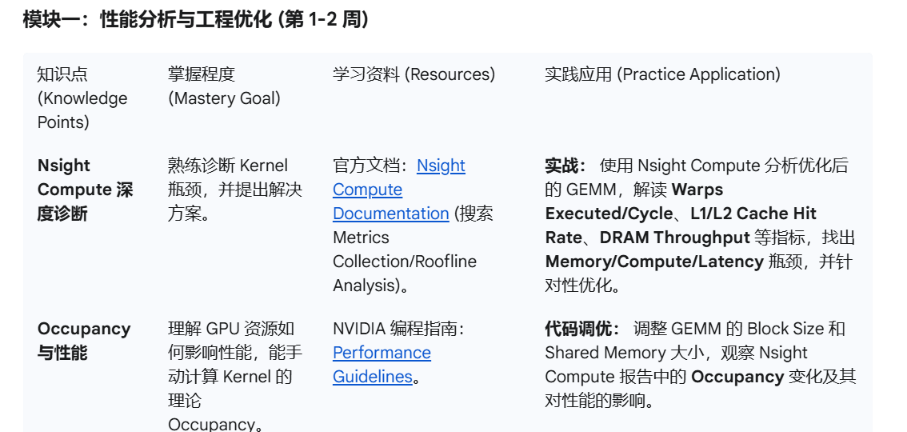

# GPU性能诊断 (CUDA)

基于 Nsight Compute的GPU性能诊断。

**官方文档：**

1. [Nsight Compute Documentation](https://docs.nvidia.com/nsight-compute)
2. [Performance Guidelins](https://docs.nvidia.com/cuda/cuda-c-programming-guide/)




## 0 核心理论知识

1. GPU硬件架构：SM的基本组成
   1. CUDA Core
   2. 寄存器File
   3. L1缓存
   4. 共享内存
   5. Tensor Core
2. CUDA基础编程模型
3. 内存模型：各级内存的特性、访问延迟、带宽
   1. 全局内存
   2. 共享内存
   3. 纹理内存 & 常量内存
   4. L2缓存
4. Warp执行机制：
   1. Warp调度
   2. Warp Divergence问题：概念、原因、解决
5. 内存访问模式： Memory Coalescing(内存合并)

## 1 性能优化策略
性能优化的基本策略如下：
1. 并行计算最大化 -> 实现利用率(utilization)最大化
2. 内存使用最优 -> 实现内存吞吐量(memory throughput)最大化
3. 指令使用最优 -> 实现指令吞吐量(instruction throughput)最大化
4. 内存抖动(thrashing)最小化

### 1.1 利用率最大化 (Maximum Utilization)
#### 1.1.1 主机应用层
**性能瓶颈：**主机、设备与总线之间的并行性能瓶颈。
**原则：**将串行Workload分配给主机，并行Workload分配给设备。
**方法：**通过异步函数调用async、流cudaStream(如事件同步、异步传输等)，平衡主机、设备和总线的工作负载。
**设备工作负载瓶颈：**
1. 同一块内的线程，在使用同一个内核的共享内存时，通过__syncthreads()完成内存同步，影响线程并行(需等待其他线程完成后继续操作，造成延迟)
2. 执行的线程分属不同线程块，无法直接实现数据共享

#### 1.1.2 设备层
**性能瓶颈：** 多个SM之间的并行执行性能。
**方法：** 使用流(cudaStream)让足够多的内核(kernels)并发执行。

#### 1.1.3 硬件层 (SM、Warp调度)
**性能瓶颈：** Warp在处理指令时的延迟(Warp Latency)。
**延迟类型：**
1. 内存操作延迟 (Memory Latency)
    1. 全局内存(Global Memory)：最主要的延迟来源。Warp发出读取指令时，数据经由 全局内存 -> L2缓存 -> SM的L1缓存 -> 寄存器，整个过程可达数百个时钟周期。
    2. 共享内存(Shared Memory)：可能的延迟来源。相比全局内存，数据可直接由块内传输。延迟来源主要为 Bank Conflict(同Warp不同线程的串行化内存操作)。
2. 指令延迟 (Instruction Latency)：较复杂的数学运算或原子操作(如atomicAdd)产生较多的时钟周期。

#### 1.1.4 延迟隐藏技术 (Latency Hiding)
**基本原理：** 通过Warp调度器，在某一Warp因等待高延迟操作结果而阻塞时，立即切换到其他就绪的Warp继续执行指令，不让计算单元(SM)闲置。
**硬件基础：** SM包含大量可执行资源(Cuda Cores、共享内存、寄存器File)，支持大量线程管理(Ampere架构可管理2048个线程)。
1. 调度器就绪队列：SM上的Warp调度器，包含若干Warps队列，其记录着所有加载到此SM的Warp状态
2. Warp切换机制：当一个Warp发出全局内存读取请求 / 执行多时钟周期的操作时，变为堵塞状态；此时调度器切换到另一个就绪的Warp，SM执行此Warp的指令
3. **零开销切换**：多重上下文机制。所有Warp的状态(程序计数器、寄存器)都已记录在SM，只需由Warp调度器改变指针，将计算单元指向下一个Warp的上下文即可让其执行指令；无需保存和恢复寄存器，造成时延。

##### 延迟隐藏的应用
###### (1) 最大化常驻Warp数量 (提升SM占用率)
**原则：**在Warp阻塞时，让SM有足够的Warp。常驻Warp的数量，受限于SM内**寄存器**和**共享内存**数量的使用。

1. **优化寄存器使用：** 控制每个线程使用的寄存器大小。由于SM的寄存器大小固定，且为全部线程共用。单个线程占用过多，会导致分配的Warp数量减少，降低延迟隐藏能力。
2. **优化共享内存使用：** 控制每个线程块使用的共享内存大小。原因同上。

Warp数量的计算：

```cpp
// 获取GPU参数
cudaGetDevice(&device);
cudaGetDeviceProperties(&prop, device);

// 常驻(活跃)Warps数
activeWarps = numBlocks * blockSize / prop.warpSize;

// SM最大Warps数
maxWarps = prop.maxThreadsPerMultiProcessor / prop.warpSize;
```

###### (2) 增加指令级并行性
**原则：** 指令穿插。在一个Warp执行某项高延迟操作后，穿插其他不依赖于操作结果的指令(如加载结果)，避免等待导致时延，而是连续执行。这种方法也称作“提升指令独立性”。
代码示例：

```cpp
// 访问全局内存，高延迟操作
float A = global_mem[idx];  
// 插入其他操作，隐藏延迟，同事等待上一操作完成
do_some_computation();
// 依赖操作，需等待 A 完成
float C = B * A;
```

###### (3) 优化内存访问模式 (最佳方式)
1. **内存合并访问 (Memory Cpalescing)**
**原则：** 同一Warp内对全局内存的访问操作(读取&写入)是连续且对齐的。这样即可将32次访问事务合并为少数几次事务，提升效率。
2. **使用共享内存 (Shared Memory)**
**原则：** 利用共享内存高带宽、低延迟的特点。对于重复访问的数据，可将数据分解后加载到共享内存中(此过程为高延迟)，再在共享内存处理并从其中访问(低延迟)。可有效降低延迟。注意访问共享内存时需要使用 __syncthreads()确保Block内线程可见性。

###### (4) 显示同步的使用 (__syncthreads && __syncwarp)
**原则：** 正确使用同步，可避免共享内存的数据访问异常；也可允许编译器和硬件正确调度，适当降低时延。

### 1.2 内存吞吐量最大化 (Maximum Memory Throughput)
**原则：**
1. 尽量减少主机与设备，即CPU与GPU之间的数据传输。CPU与GPU采用PCIE总线连接，传输速率远小于GPU内部(GDDR或HBM)。
2. 最大化片上内存(SM)使用，减少全局内存访问事务。即使用共享内存和L1缓存，和全设备可用的常量内存、纹理内存。
通常会增加共享内存的使用，进行数据加载并同步块内线程。

### 1.3 内存抖动最小化 (Minimize Memory Thrashing)
**原则：**
1. 合理分配内存规模。尽量避免占用全部可用内存，内存分配指令如 cudaMalloc, cudaMallocHost，会加OS调度器压力，或强制中断其他GPU程序。
2. 需要时分配。不需要时，避免使用分配(cudaMalloc)和销毁(cudaFree)命令。
3. 灵活使用内存类型。当可用内存不够时，考虑使用固定内存(cudaMallocHost)或统一内存(cudaMallocManaged)。
4. 适当使用统一内存。统一内存(cudaMallocManaged)不会立刻占用内存空间，可减轻OS调度器压力；且较高级的架构支持oversubstitution功能。

## 2 基础指标

## 3 问题定位

### 3.1 Warp Divergence

### 3.2 Bank Conflict
